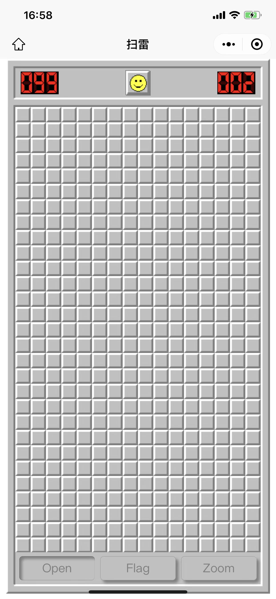

# 扫雷

用 Vue 实现的微信小程序版扫雷

<!-- PROJECT SHIELDS -->

<!-- [![Contributors][contributors-shield]][contributors-url]
[![Forks][forks-shield]][forks-url]
[![Stargazers][stars-shield]][stars-url]
[![Issues][issues-shield]][issues-url]
[![MIT License][license-shield]][license-url]
[![LinkedIn][linkedin-shield]][linkedin-url] -->

<!-- PROJECT LOGO -->
<br />

<p align="center">
  <a href="https://github.com/laoycz/minesweeper-mp">
    
  </a>
  <!-- <p align="center">
    <br />
    <a href="https://github.com/laoycz/minesweeper-mp">查看Demo</a>
    ·
    <a href="https://github.com/laoycz/minesweeper-mp/issues">报告Bug</a>
    ·
    <a href="https://github.com/laoycz/minesweeper-mp/issues">提出新特性</a>
  </p> -->

</p>

## 目录

- [上手指南](#上手指南)
  - [开发前的配置要求](#开发前的配置要求)
  - [安装步骤](#安装步骤)
- [文件目录说明](#文件目录说明)
- [开发的架构](#开发的架构)
- [使用到的框架](#使用到的框架)
- [游戏截图](#游戏截图)

### 上手指南

#### 开发前的配置要求

1. 微信开发者工具
2. Node.js - pnpm

#### **安装步骤**

1. Clone the repo
2. pnpm install --shamefully-hoist
3. pnpm dev:mp-weixin
4. 用微信开发者工具打开 dist/dev/mp-weixin

```sh
git clone https://github.com/laoycz/minesweeper-mp
```

### 文件目录说明

```
├── index.html
├── package.json
├── pnpm-lock.yaml
├── src
│   ├── App.vue
│   ├── env.d.ts
│   ├── Game.ts
│   ├── Home.vue
│   ├── main.ts
│   ├── manifest.json
│   ├── Matrix.ts
│   ├── pages
│   │   ├── home
│   │   │   └── index.vue
│   │   └── index
│   │       └── index.vue
│   ├── pages.json
│   ├── static
│   ├── uni.scss
│   └── Zone.ts
├── tsconfig.json
└── vite.config.ts
```

### 开发的架构

使用 uni-app cli 模式生成小程序框架

### 使用到的框架

- [Vue](https://vuejs.org/)
- [uni-app](https://uniapp.dcloud.net.cn/)
- [微信开发者工具](https://developers.weixin.qq.com/miniprogram/dev/devtools/devtools.html)

### 游戏截图

<div>
  
  
  
  
</div>
